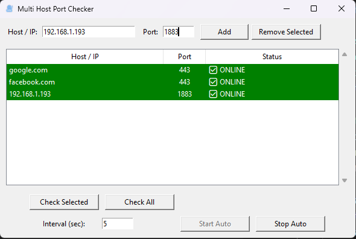

# Multi Host Port Checker



[]() []() []()

A simple and efficient network monitoring tool built with **Python Tkinter**. This application allows you to add multiple hosts and ports, check their connectivity, and automatically refresh the status at defined intervals.

---

## 📌 Features (Enhanced)
- Modernized layout with better spacing and cleaner alignment
- Professional icon support for both app window and EXE
- Real-time color-coded monitoring
- Auto refresh engine with interval control

### ✔ Check Multiple Host/Port
Add as many hosts as you want, each with a specific port.

### ✔ Auto Refresh (Interval)
Automatically monitors all hosts every X seconds without freezing the UI.

### ✔ Real-time Status
- **Green** → ONLINE
- **Red** → OFFLINE
- **Gray** → Not checked yet

### ✔ Add / Remove Hosts
Simple UI to manage host list.

### ✔ Portable EXE
Built using PyInstaller — no need to install Python on target machines.

---

## 🚀 Installation Guide

### 1. Requirements
- Python 3.9+
- Windows OS (for EXE build)

### 2. Clone Repository
```bash
git clone https://github.com/<your-username>/<repo-name>.git
cd <repo-name>
```

### 3. Setup Virtual Environment
```bash
python -m venv venv
venv\Scripts\activate
```

### 4. Run the Application
```bash
python multi_port_checker.py
```

### 1. Clone Repository
```
git clone https://github.com/<your-username>/<repo-name>.git
cd <repo-name>
```

### 2. Create Virtual Environment
```
python -m venv venv
venv\Scripts\activate
```

### 3. Install Dependencies
*(This project uses only built-in Python modules — no external requirements.)*

---

## 🖥 Running the Application
```
python multi_port_checker.py
```

---

## 📦 Build as EXE (Windows)
Use PyInstaller:
```
pyinstaller --noconfirm --onefile --windowed \
  --name MultiPortChecker \
  --icon=icon_network_transparent.ico \
  --add-data "icon_network_transparent.ico;." \
  multi_port_checker.py
```
Output EXE will be found in:
```
dist/MultiPortChecker.exe
```

## 🎥 Demo GIF

> ตัวอย่างการทำงานของโปรแกรม (Add your GIF here)


---

## 🖼 Screenshot

> ภาพหน้าจอหลักของโปรแกรม


## 🧩 File Structure
```
project/
│   multi_port_checker.py
│   icon_network_transparent.ico
│   README.md
│   screenshot.png
│   .gitignore
│
└── venv/                # Virtual environment
```

---

## 🛣 Roadmap
- [ ] Add Ping status alongside Port check
- [ ] Export/Import host lists (.json)
- [ ] Add system tray support
- [ ] Sound notification when host goes offline
- [ ] Dark/Light theme switching
- [ ] Logging to external file

```
project/
│   multi_port_checker.py
│   icon_network_transparent.ico
│   README.md
│   .gitignore
│
└── venv/                # Virtual environment
```

---

## 🤝 Contributing
Pull requests are welcome! Open an issue first to discuss any major changes.

---

## 📄 License
This project is licensed under the MIT License.

---

## ⭐ If you like this tool
Give the repository a star to support future updates! 🌟

